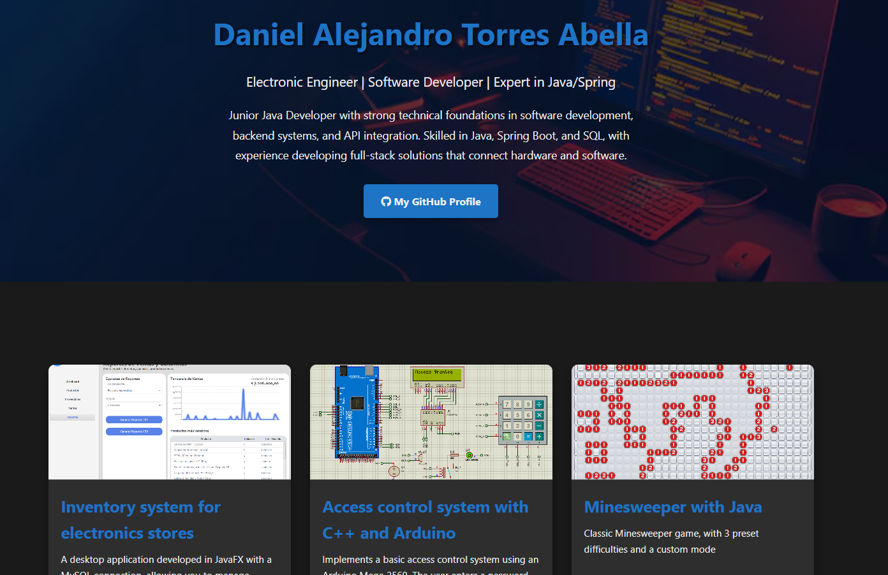

# 💼 Professional Portfolio — Daniel Torres 

## 🧑‍💻 Description

This project is my **professional portfolio**, designed to showcase my skills as a **Junior Software Developer**, with a focus on **Java, Spring Boot, and backend development**.  
It includes a personal introduction, a gallery of featured projects, and a simple contact section — all built with a modern, responsive layout.

The website is deployed on **Vercel**, using clean **HTML and CSS**.

---

## 🔗 Live Demo

🌍 **Visit my portfolio here:**  
👉 [https://daniel-torres-portfolio.vercel.app/](https://daniel-torres-portfolio.vercel.app/)

---

## 🚀 Technologies Used

- **HTML5** → semantic structure of the site  
- **CSS3** → custom styles, variables, and responsive design  
- **Font Awesome** → icons for buttons and links  
- **Vercel** → static site deployment  

---

## 🧱 Project Structure

    Portafolio/
    │
    ├── images/
    │ └── Start.png # Preview image for README
    │
    ├── src/
    │ ├── img/ # Images used in the website
    │ │ ├── Fondo.jpg
    │ │ ├── InvImg.png
    │ │ ├── Pr2.png
    │ │ └── Pr3.png
    │ ├── index.html # Main HTML file
    │ └── style.css # Stylesheet
    │
    └── ReadMe.md

---

## 🖼️ Site Preview

---

## 🌐 Deployment on Vercel

This portfolio is hosted on **Vercel**.  

